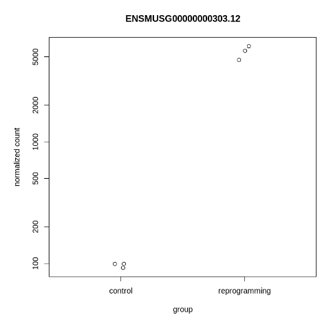

# hse21_hw3

## Выравнивание генома
Ссылка на колаб с выравниванием \
[https://colab.research.google.com/drive/1BQ8HtVDnh-iux1QvKiVTNWb8i1IKbUJL?usp=sharing](https://colab.research.google.com/drive/1BQ8HtVDnh-iux1QvKiVTNWb8i1IKbUJL?usp=sharing)
Ссылка на R колаб со статистикой \
[https://colab.research.google.com/drive/14SA50M2BkBU3dPb8wr_r1VklMoLXOLBW?usp=sharing](https://colab.research.google.com/drive/14SA50M2BkBU3dPb8wr_r1VklMoLXOLBW?usp=sharing)

Скриншоты из html файлов полученные из fastqc (сами эти файлы так же представлены в репозитории) \
### SRR3414629

### SRR3414630

### SRR3414631

### SRR3414635

### SRR3414636

### SRR3414637

## Таблица статистики по картированнию
| ID | Тип | Всего чтений | Откартированно чтений| Процент откартированных | Уникально откартированно | Процент уникально откартированных | Всего на генах |
|----|-----|--------------|-----------------------|-----------------------|---|---|---|
|SRR3414629| reprogramming | 21106089 | 18375888 | 87% | 16049609 | 87% | 16771781 |
|SRR3414630| reprogramming | 15244711 | 13186139 | 86% | 11465324 | 87% |  11945844 |
|SRR3414631| reprogramming | 24244069 | 20928945 | 86% | 18408851 | 88% | 19228591 |
|SRR3414635| control | 20956475 | 18428317 | 88% | 16275997 | 88% | 17036131 |
|SRR3414636| control | 20307147 | 17825380 | 88% | 15757580 | 88% | 16492688 |
|SRR3414637| control | 20385570 | 17844858 | 88% | 15736978 | 88% | 16447208 |

## Графики со статистиками
### Тепловая карта экспрессии

### MAplot

### Гены более всего поменявшие свою экспрессию

