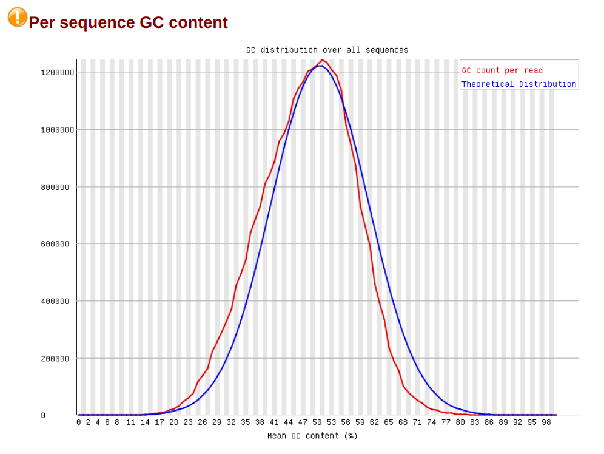

# hse21_hw3

## Выравнивание генома
Ссылка на колаб с выравниванием \
[https://colab.research.google.com/drive/1BQ8HtVDnh-iux1QvKiVTNWb8i1IKbUJL?usp=sharing](https://colab.research.google.com/drive/1BQ8HtVDnh-iux1QvKiVTNWb8i1IKbUJL?usp=sharing)

Скриншоты из html файлов полученные из fastqc (сами эти файлы так же представлены в репозитории) \
### SRR3414629

### SRR3414630

### SRR3414631

### SRR3414635

### SRR3414636

### SRR3414637

